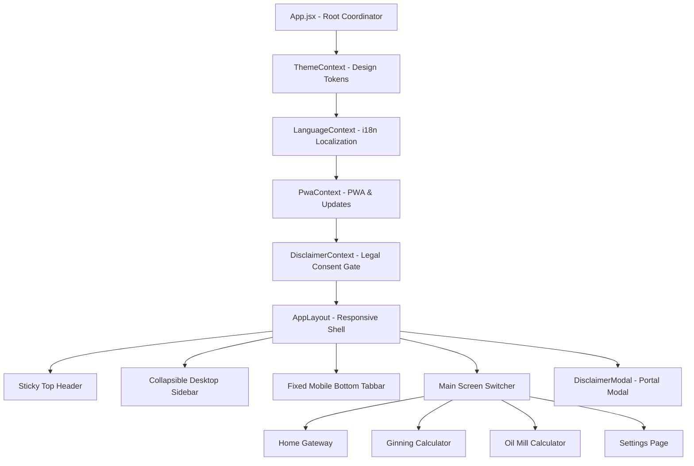

# CottonCalc Pro
### Professional Cotton Ginning & Cottonseed Oil Mill Calculator

A high-performance, production-grade Progressive Web Application (PWA) specifically designed for **Cotton Ginners**, **Commodity Brokers**, **Cottonseed Oil Mill Operators**, and **Agribusiness Traders**. 

CottonCalc Pro enables instant, mathematically verified calculation of lint production parity, raw cotton break-even purchase rates, crushing profit margins, oil cake cost realization, and factory recovery ratios.

---

## 📑 Table of Contents

- [Key Features](#-key-features)
- [Industry Conversion Standards](#-industry-conversion-standards)
- [Module Workflows & Mathematical Logic](#-module-workflows--mathematical-logic)
  - [1. Cotton Ginning Calculator](#1-cotton-ginning-calculator)
    - [A. Cost Parity (Candy Cost)](#a-cost-parity-candy-cost)
    - [B. Reverse Parity (Break-Even Kapas Rate)](#b-reverse-parity-break-even-kapas-rate)
    - [C. Output Ratio (G.O.T. Analysis)](#c-output-ratio-got-analysis)
  - [2. Cottonseed Oil Mill Calculator](#2-cottonseed-oil-mill-calculator)
    - [A. Khal Cost Parity](#a-khal-cost-parity)
    - [B. Crushing Profit & Loss](#b-crushing-profit--loss)
    - [C. Oil Mill Recovery](#c-oil-mill-recovery)
- [Architecture & Technical Stack](#-architecture--technical-stack)
- [Compliance, Legal & Disclaimer Consent Gate](#-compliance-legal--disclaimer-consent-gate)
- [Project Directory Structure](#-project-directory-structure)
- [Getting Started](#-getting-started)
  - [Prerequisites](#prerequisites)
  - [Installation](#installation)
  - [Development Server](#development-server)
  - [Production Build](#production-build)
  - [Verifying Mathematical Logic](#verifying-mathematical-logic)
- [PWA & Offline Capabilities](#-pwa--offline-capabilities)
- [Localization (i18n) & Regional Trade Terminology](#-localization-i18n--regional-trade-terminology)

---

## 🌟 Key Features

- **Real-Time Financial Parity**: Eliminates manual spreadsheets and paper formulas with instant, reactive calculations for cotton processing contracts and daily mandi trading.
- **Customizable Processing Expense Units**: Select your preferred cost unit for processing charges—**per Maund (20 kg)** (default for regional ginning/oil mills), **per Ton (1000 kg)**, or **per Quintal (100 kg)**.
- **Progressive Web App (PWA)**: Installable as a native standalone application on Android, iOS Safari, Windows, and macOS with full offline caching via Service Worker.
- **Mandatory Terms & Disclaimer Consent Gate**: Built-in compliance gateway requiring first-time user acceptance before entering the application, with automatic re-prompting on app version updates.
- **Audit Log in Settings**: Displays recorded user consent timestamp (`Date & Time`) alongside app version and review controls.
- **Multi-Language Support (i18n)**: Seamless zero-reload switching between **English**, **Gujarati (ગુજરાતી)**, and **Hindi (हिन्दी)** with industry-accurate vernacular terminology.
- **Adaptive Theme System**: Choose between **Light Mode**, **Dark Mode**, and automatic **System Mode** synchronization.
- **Interactive Information & Formula Guide**: Every calculator view includes an in-app help modal detailing input descriptions, step-by-step instructions, and official trade formulas.
- **Modern Liquid Glass UI**: Responsive interface featuring a collapsible desktop sidebar, sticky headers, animated splash screen, and fixed mobile bottom tabbar with touch-optimized targets.

---

## ⚖️ Industry Conversion Standards

The Indian cotton trading and processing sector operates on historical benchmark units codified into this application:

| Unit Name | Regional Trade Name | Standard Equivalent | Primary Use |
|:---|:---|:---|:---|
| **1 Candy (Khandi)** | કાનડી / खांडी | **355.62 kg** (or ~356 kg) | Standard commercial unit for Ginned Lint Cotton trading |
| **1 Maund (Man)** | મણ / मन | **20 kg** | Standard unit for Raw Seed Cotton (Kapas) in APMC Mandis |
| **1 Quintal** | ક્વિન્ટલ / क्विंटल | **100 kg** | Standard weight for bulk agricultural commodities & oil cake |
| **1 Ton (Metric Ton)**| ટન / टन | **1,000 kg** | Commercial unit for Cottonseed purchases & crushing lots |
| **1 Bag (Khal)** | ગુણી / बोरी | **50 kg** | Standard retail package weight for Cottonseed Oil Cake (Khal) |

---

## 🧮 Module Workflows & Mathematical Logic

### 1. Cotton Ginning Calculator

#### A. Cost Parity (Candy Cost)
Determines the net manufacturing cost of producing **1 Candy (355.62 kg)** of lint cotton from raw Kapas, after deducting revenue realized from byproduct cottonseed and accounting for processing expenses.

- **Key Inputs**:
  - `Kapas Rate`: Purchase price of raw seed cotton (₹ per 20 kg Maund)
  - `Outturn (G.O.T.) %`: Ginning Outturn ratio (typically 32% to 36%)
  - `Cottonseed Rate`: Selling rate of seed (₹ per 20 kg Maund or ₹ per Ton / Quintal)
  - `Seed Ratio %`: Expected cottonseed yield (typically 62% to 65%)
  - `Processing Expense`: Ginning, pressing, and handling charges per unit
- **Core Formulas**:
  $$\text{Kapas Required for 1 Candy (kg)} = \frac{355.62}{\text{Outturn \%} / 100}$$
  $$\text{Gross Kapas Cost} = \left(\frac{\text{Kapas Required}}{20}\right) \times \text{Kapas Rate per Maund}$$
  $$\text{Seed Generated (kg)} = \text{Kapas Required} \times \left(\frac{\text{Seed Ratio \%}}{100}\right)$$
  $$\text{Seed Realization Value} = \left(\frac{\text{Seed Generated}}{20}\right) \times \text{Seed Rate per Maund}$$
  $$\mathbf{Cost\ per\ Candy\ (Net)} = \text{Gross Kapas Cost} - \text{Seed Realization Value} + \text{Total Ginning Expense}$$

#### B. Reverse Parity (Break-Even Kapas Rate)
Calculates the **maximum procurement rate** a ginner can pay per 20 kg Maund of raw Kapas to break even at current market lint prices.

- **Key Inputs**:
  - `Target Lint Rate`: Current selling price of lint (₹ per Candy)
  - `Outturn (G.O.T.) %`: Expected lint yield percentage
  - `Cottonseed Rate`: Current market selling price of seed
  - `Ginning Expense`: Processing cost per Maund of Kapas
- **Core Formula**:
  $$\mathbf{Max\ Kapas\ Purchase\ Rate} = \left[\left(\frac{\text{Lint Rate per Candy} + \text{Seed Recovery Value per Candy}}{355.62}\right) \times \left(\frac{\text{Outturn \%}}{100}\right) \times 20\right] - \text{Ginning Expense}$$

#### C. Output Ratio (G.O.T. Analysis)
Analyzes laboratory sample tests (e.g., 100g sample) or bulk commercial ginning lots to determine the exact Ginning Outturn (G.O.T.) percentage, seed ratio, and moisture/trash loss.

- **Features**:
  - Instant sample test mode (`g`) and commercial lot mode (`kg`).
  - Real-time total verification with automatic warning alert if component weights do not sum up to 100%.
  - Dynamic conic-gradient visual ring chart displaying component yield distribution.
- **Core Formulas**:
  $$\text{Lint Outturn (G.O.T.) \%} = \left(\frac{\text{Lint Weight}}{\text{Total Kapas Weight}}\right) \times 100$$
  $$\text{Seed Ratio \%} = \left(\frac{\text{Seed Weight}}{\text{Total Kapas Weight}}\right) \times 100$$
  $$\text{Moisture \& Trash Loss \%} = \left(\frac{\text{Waste Weight}}{\text{Total Kapas Weight}}\right) \times 100$$

---

### 2. Cottonseed Oil Mill Calculator

#### A. Khal Cost Parity
Calculates the net cost of manufacturing **Cottonseed Oil Cake (Khal)** per 50 kg bag, per Maund (20 kg), per Quintal (100 kg), or per kg after crediting revenue from Wash Oil and factoring in crushing expenses.

- **Key Inputs**:
  - `Seed Purchase Rate`: Cost of raw cottonseed (₹ per Ton or ₹ per 20 kg Maund)
  - `Oil Recovery %`: Wash oil extraction percentage (typically 10% to 13%)
  - `Oil Sale Rate`: Selling price of crude/wash oil (₹ per 10 kg / 15 kg / 20 kg)
  - `Khal Yield %`: Oil cake recovery percentage (typically 82% to 86%)
  - `Crushing Expense`: Milling and processing cost per Ton or per Maund
- **Core Formulas**:
  $$\text{Wash Oil Value} = \text{Oil Yield (kg)} \times \text{Oil Rate per kg}$$
  $$\text{Net Crushing Cost} = \text{Seed Cost} + \text{Processing Expense} - \text{Wash Oil Value}$$
  $$\mathbf{Cost\ of\ Khal\ per\ Bag\ (50kg)} = \left(\frac{\text{Net Crushing Cost}}{\text{Total Khal Produced (kg)}}\right) \times 50$$

#### B. Crushing Profit & Loss
Evaluates the commercial viability and net operating profit or loss per Ton (1,000 kg) of cottonseed processed.

- **Key Outputs**:
  - Total Raw Material & Operating Expense
  - Total Gross Realization (Wash Oil + Khal + Mill Waste / Sludge)
  - Net Profit or Loss per Ton with color-coded visual indicator (Green for profit, Red for loss)
- **Core Formulas**:
  $$\text{Total Realization} = (\text{Oil kg} \times \text{Oil Price/kg}) + (\text{Khal kg} \times \text{Khal Price/kg}) + (\text{Waste kg} \times \text{Waste Price/kg})$$
  $$\mathbf{Net\ Profit\ /\ Loss} = \text{Total Realization} - (\text{Seed Purchase Cost} + \text{Milling Expense})$$

#### C. Oil Mill Recovery
Calculates industrial output distribution across **Wash Oil**, **Cottonseed Cake (Khal)**, and **Mill Waste / Moisture Loss** from any input weight of cottonseed.

- **Formula**:
  $$\text{Recovery \%} = \left(\frac{\text{Product Yield Weight}}{\text{Total Seed Crushed Weight}}\right) \times 100$$

---

## 🏗️ Architecture & Technical Stack



- **Frontend Core**: [React 18](https://react.dev/) (Functional components, custom hooks, reactive state).
- **Build Tooling**: [Vite 6](https://vitejs.dev/) with Hot Module Replacement (HMR) and optimized rollup production bundling.
- **Styling Engine**: Pure CSS Design Tokens combined with [Tailwind CSS](https://tailwindcss.com/) utilities for high performance and zero runtime CSS-in-JS overhead.
- **State Management**:
  - `ThemeContext.jsx`: Handles System/Light/Dark mode transitions and media query listeners.
  - `LanguageContext.jsx`: Provides instant dictionary lookups without page reload.
  - `PwaContext.jsx`: Monitors online/offline network events, service worker registration, and installation prompts.
  - `DisclaimerContext.jsx`: Controls legal consent gateway, app version checking via `version.json`, and acceptance audit timestamps.

---

## 🛡️ Compliance, Legal & Disclaimer Consent Gate

To ensure regulatory transparency and protect stakeholders:

1. **Mandatory First-Time Gate**:
   - When a user first opens the application, an un-dismissible modal appears (`DisclaimerModal.jsx`).
   - The user must review all 5 core legal clauses, check the agreement box (`I have read, understood, and agree...`), and click **"Accept & Continue"**.
   - Backdrop clicking and Escape keys are strictly disabled during mandatory consent mode.
2. **Automatic Re-Prompt on App Version Updates**:
   - `DisclaimerContext` fetches `/version.json` with a cache-busting timestamp on startup.
   - If the application updates to a newer version (e.g., `1.0.0` $\to$ `1.1.0`), the consent gate activates again so users re-acknowledge terms for the updated release.
3. **Settings Page Audit Log**:
   - Card 5 in `SettingsPage.jsx` displays a green **"ACCEPTED"** badge with checkmark icon.
   - Shows the exact date and time of user acceptance (e.g., `Accepted on 30/09/2026, 3:52 PM (v1.0.0)`).
   - Includes a **"View Terms & Disclaimer"** button allowing users to review the complete legal text at any time.

---

## 📁 Project Directory Structure

```text
Cotton Ginning Calculator/
├── public/
│   ├── favicon.svg                 # SVG browser icon
│   ├── icon-192.png                # Standard 192x192 PWA icon
│   ├── icon-512.png                # Standard 512x512 PWA icon
│   ├── icon-maskable-192.png       # Android adaptive maskable icon
│   ├── icon-maskable-512.png       # Android adaptive maskable icon
│   ├── apple-touch-icon.png        # iOS Safari home screen icon
│   ├── manifest.webmanifest        # PWA configuration manifest
│   ├── sw.js                       # Service worker caching and offline handler
│   └── version.json                # Live deployment version metadata
├── src/
│   ├── components/
│   │   ├── common/
│   │   │   ├── AppFooter.jsx       # Global footer with trade units & estimation note
│   │   │   ├── DisclaimerContext.jsx # Consent gate state & version detection
│   │   │   ├── DisclaimerModal.jsx # Full-screen mandatory gate & review modal
│   │   │   ├── Icons.jsx           # Clean SVG iconography suite
│   │   │   ├── PageInfo.jsx        # Liquid glass modal with formulas & guide
│   │   │   └── SplashScreen.jsx    # Animated launch screen with smooth fade-out
│   │   ├── ginning/
│   │   │   ├── GinningCalculator.jsx   # Ginning container & tab switcher
│   │   │   ├── ParityTab.jsx           # 1. Cost Parity calculation
│   │   │   ├── ReverseParityTab.jsx    # 2. Reverse break-even buy rate
│   │   │   └── OutputRatioTab.jsx      # 3. G.O.T. % & conic donut chart
│   │   ├── home/
│   │   │   └── HomeScreen.jsx      # Feature cards with direct tab routing
│   │   ├── layout/
│   │   │   ├── AppLayout.jsx       # Multi-platform shell coordinator
│   │   │   ├── Header.jsx          # Top bar with view titles, lang & theme
│   │   │   ├── MobileNavigation.jsx # Mobile bottom navigation tabbar
│   │   │   └── Sidebar.jsx         # Collapsible desktop sidebar
│   │   ├── oil/
│   │   │   ├── OilMillCalculator.jsx # Oil mill container & tab switcher
│   │   │   ├── KhalParityTab.jsx   # 1. Khal cost of production
│   │   │   ├── OilProfitTab.jsx    # 2. Crushing profit/loss per Ton
│   │   │   └── OilRecoveryTab.jsx  # 3. Recovery output in kg & %
│   │   └── settings/
│   │       └── SettingsPage.jsx    # Appearance, language, legal & PWA settings
│   ├── i18n/
│   │   ├── en.json                 # English dictionary
│   │   ├── gu.json                 # Gujarati (ગુજરાતી) dictionary
│   │   ├── hi.json                 # Hindi (हिन्दी) dictionary
│   │   └── LanguageContext.jsx     # i18n provider & useTranslation hook
│   ├── pwa/
│   │   ├── InstallModal.jsx        # Device-specific installation dialog
│   │   ├── OfflineBanner.jsx       # Live network status warning bar
│   │   ├── PwaContext.jsx          # PWA install prompt & update listener
│   │   ├── UpdateBanner.jsx        # Top update banner
│   │   └── UpdateModal.jsx         # Instant update execution dialog
│   ├── theme/
│   │   ├── theme.css               # Design tokens (light / dark)
│   │   └── ThemeContext.jsx        # Theme provider & useTheme hook
│   ├── utils/
│   │   ├── calculations.js         # Pure mathematical calculation functions
│   │   └── formatting.js           # Number & Indian currency (₹) formatters
│   ├── App.jsx                     # Root application coordinator
│   ├── index.css                   # Global styling & responsive layouts
│   └── main.jsx                    # Application bootstrap & SW registration
├── index.html                      # PWA meta tags & HTML template
├── package.json                    # Project dependencies and npm scripts
├── tailwind.config.js              # Tailwind CSS configuration
├── test-calculations.js            # Automated mathematical unit test suite
└── vite.config.js                  # Vite configuration
```

---

## 🚀 Getting Started

### Prerequisites
- [Node.js](https://nodejs.org/) (Version `18.0.0` or higher recommended)
- `npm` (Version `9.0.0` or higher)

### Installation
Clone the repository and install the project dependencies:
```bash
git clone https://github.com/Jenish-Patel-Dev/CottonCalc-Pro.git
cd "Cotton Ginning Calculator"
npm install
```

### Development Server
Start the local development server with Hot Module Replacement:
```bash
npm run dev
```
Open your browser and navigate to `http://localhost:5173`.

### Production Build
Compile and bundle the production-ready assets:
```bash
npm run build
```
The optimized output will be generated inside the `dist/` directory.

To preview the production build locally:
```bash
npm run preview
```

### Verifying Mathematical Logic
Run the automated formula test suite to verify calculation parity across all modules:
```bash
node test-calculations.js
```

---

## 📲 PWA & Offline Capabilities

CottonCalc Pro is built from the ground up as a **Progressive Web Application**:

1. **Installation Across Devices**:
   - **Desktop (Chrome / Edge / Brave)**: Click the **Install Application** button in the header or the install icon in the address bar.
   - **Android (Chrome)**: Tap **Install Application** from the in-app modal or select **Add to Home screen** from the browser menu.
   - **iOS (Safari)**: Tap the **Share** button at the bottom of Safari, scroll down, and select **Add to Home Screen**.
2. **Offline-First Resilience**:
   - The application shell, HTML, CSS, JavaScript, icons, and translation dictionaries are cached via `sw.js`.
   - If internet connectivity is lost, the app remains fully functional and displays an **Offline Mode** indicator.
3. **Instant Seamless Updates**:
   - When an updated build is deployed to the server, the service worker detects the new assets and displays a prompt notifying the user to reload for the latest version.

---

## 🌐 Localization (i18n) & Regional Trade Terminology

CottonCalc Pro supports 3 languages with dedicated regional terminology:

- 🇬🇧 **English**: Standard international commodity terminology.
- 🇮🇳 **ગુજરાતી (Gujarati)**: Official market terms used in Gujarat mandis (કાપાસ, કાનડી, મણ, ખોળ, કપાસિયા, આઉટટર્ન).
- 🇮🇳 **हिन्दी (Hindi)**: North & Central Indian mandi terms (कपास, खांडी, मन, बिनौला, खल, आउटटर्न).

All dictionary entries are managed in structured JSON files (`src/i18n/{en,gu,hi}.json`) and can be extended to additional regional languages (such as Marathi, Telugu, or Tamil).

---

## 📄 License & Disclaimer

CottonCalc Pro is developed for calculation and commercial estimation purposes only. Commercial decisions, contracts, and financial settlements should be independently verified with official weighbridge slips, laboratory test reports, and quality parameters.
